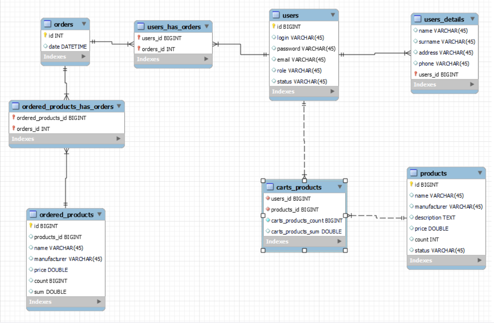

# online store
# RESTful Web-application is written using the following technologies: 
  - Gradle 
  - JDBC 
  - MySQL DB 
  - Spring Framework
### Short description of the project
Online store 

### Prerequisites:
- Tomcat
- Java 11
- MySQl

# Data model
## ER diagram for the data model

## RESTful API

1. API Description of general methods for User

METHOD | PATH | DESCRIPTION
------------|-----|------------
POST | /api/users| register new user
PUT | /api/users/{id}| update user by id
GET | /api/users/{id}| get user by id
delete | /api/users| delete user by id 

2. API Description of general methods for Product

METHOD | PATH | DESCRIPTION
------------|-----|------------
GET | /api/products/{id} | get product by id
GET | /api/products| update user 
POST | /api/products| register new product
delete | /api/products| delete user by id

3. API Description of general methods for CartProduct

METHOD | PATH | DESCRIPTION
------------|-----|------------
GET | /api/cartProduct| get cartProduct by user id and product id
POST | /api/cartProduct| add product in cart
delete | /api/cartProduct| delete user by user id
delete | /api/cartProduct| delete user by user id and product id

4. API Description of general methods for Order

METHOD | PATH | DESCRIPTION
------------|-----|------------
GET | /api/cartProduct/{id}| get cartProduct by user id 
GET | /api/cartProduct| get cartProduct
POST | /api/cartProduct| add order 

### My application requests in Postman
